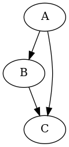

# Graphviz and State Machine Visualization

[Graphviz](https://graphviz.org/) is an open source graph visualization software. It takes descriptions of graphs in a simple text language, and makes diagrams out of them. 

## Why Visualize State Machines?

In this project, we are building conversational bots using a [state machine](./state-machines.md) architecture. State machines can get complex fast as more states and transitions are added. 

Visualizing the state machine makes it much easier to understand, debug, and maintain the bot conversation flows.

## Using Graphviz 

The `DialogStateMachine` class has a `to_graphviz()` method that outputs the text description of the state machine.

To generate an image, this text can then be piped to the Graphviz `dot` program:

```
dot -Tpng state_machine.dot -o state_machine.png
```

Some online Graphviz viewers also allow pasting the text description.

Graphviz makes it easy to visually trace path through complex state machines. The nodes represent states, and edges represent transitions between states.

For example, given this state machine text:

```
digraph G {
   A -> B
   B -> C
   A -> C
}
```

Graphviz would generate:



## In This Project

The state machines in this project leverage Graphviz to allow:

- Visualizing state machine for bots
- Printing state machine on console while testing
- Persisting state machine images alongside code

This makes it much faster to build and debug conversational bot flows compared to trying to visualize purely in code!
